# Noctyl flow diagrams

This document collects flow and architecture diagrams for the Noctyl pipeline. All diagrams use Mermaid and can be rendered on GitHub or in any Mermaid-capable viewer.

**Maintenance:** Keep this document in sync with the codebase. When adding or changing pipeline steps (e.g. edge extraction, entry point, compile, repo scanner, Phase 2 GraphAnalyzer), add or update the corresponding diagram and section here.

---

## 1. LangGraph ingestion pipeline (Phase-1)

End-to-end flow from Python source to extracted graph structure.

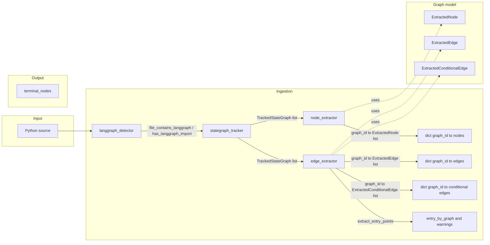

**Steps:**
0. **Repo scanning** — `discover_python_files(root_path)` yields the list of `.py` paths to analyze; default ignores `.venv`, `venv`, `site-packages`, `tests`, `.git`, `__pycache__` (see [§8](#8-repo-scanning-file-discovery)).
1. **langgraph_detector** — File-level check: does this file contain LangGraph? (`file_contains_langgraph`, `has_langgraph_import`).
2. **stategraph_tracker** — Find every `StateGraph(...)` and track variable name and `graph_id` per instance.
3. **node_extractor** — For each tracked graph, find `add_node(name, callable)` calls whose receiver resolves to that graph; emit `ExtractedNode(name, callable_ref, line)` per graph. Uses shared **receiver_resolution** (alias map + resolve_receiver).
4. **edge_extractor** — For each tracked graph: (a) `add_edge(source, target)` -> `ExtractedEdge(source, target, line)`; (b) `add_conditional_edges(source, path, path_map)` with dict-literal path_map -> one `ExtractedConditionalEdge(source, condition_label, target, line)` per path_map entry. END as target supported. (c) **Entry point:** `extract_entry_points` returns `(entry_by_graph, warnings)` from `set_entry_point(name)` or fallback from single `add_edge(START, target)`; warning when missing. Same receiver resolution.
5. **Graph schema:** Ingestion outputs (nodes, edges, conditional_edges, entry_point per graph_id) are assembled into a **WorkflowGraph** via `build_workflow_graph`; **workflow_graph_to_dict** produces a deterministic JSON-serializable dict; JSON Schema in `noctyl/graph/schema.json` describes the serialized shape. **END and terminal nodes:** END is represented as target `"END"` in edges and conditional_edges; `terminal_nodes` is a first-class list of node names that have an outgoing edge or conditional edge to END (distinguishable without scanning edges).

---

## 2. Graph schema and serialization

Ingestion outputs per graph_id are aggregated into WorkflowGraph and serialized to JSON.

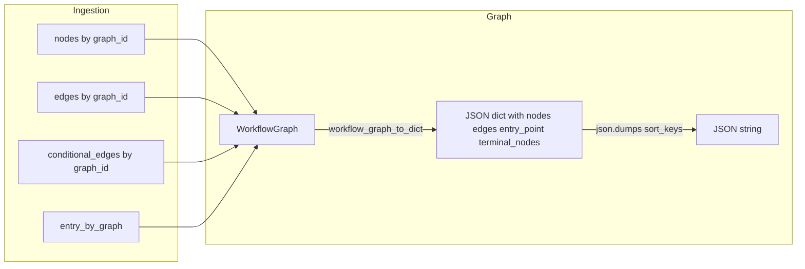

**Data flow:**
- **build_workflow_graph(graph_id, nodes, edges, conditional_edges, entry_point)** builds a WorkflowGraph (schema_version, graph_id, nodes, edges, conditional_edges, entry_point, terminal_nodes). `terminal_nodes` is derived from edges and conditional_edges (sources where target is `"END"`).
- **workflow_graph_to_dict(g)** returns a dict with deterministic list ordering (nodes by name/line, edges by source/target/line, conditional_edges by source/condition_label/target/line). The serialized dict includes **terminal_nodes** (sorted list of node names that transition to END).
- **JSON Schema:** `noctyl/graph/schema.json` defines the serialized document shape (nodes, directed edges, entry_point, terminal_nodes).

---

## 3. Node extraction flow

How add_node calls are attributed to tracked StateGraph instances.

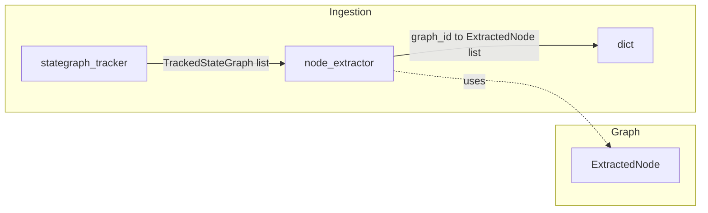

**Data flow:**
- **Input:** `(source, file_path, list[TrackedStateGraph])`.
- **Same-file alias resolution:** Build `name -> root` so that `h = g` and `g` = StateGraph variable implies `h.add_node(...)` is attributed to `g`’s `graph_id`.
- **Output:** `dict[graph_id, list[ExtractedNode]]` with `ExtractedNode(name, callable_ref, line)`.

---

## 4. Edge extraction flow

How add_edge calls are attributed to tracked StateGraph instances.

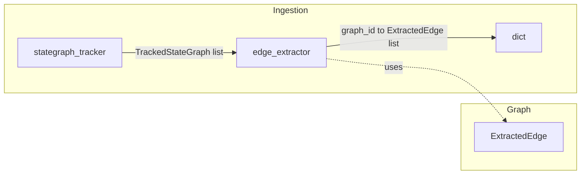

**Data flow:**
- **Input:** `(source, file_path, list[TrackedStateGraph])`.
- **Same-file alias resolution:** Same as node extraction (shared `receiver_resolution.build_alias_map`, `resolve_receiver`).
- **Source/target:** Literal string -> value; Name (e.g. START, END) -> id; other -> unparse/repr. Missing nodes do not prevent extraction.
- **Output:** `dict[graph_id, list[ExtractedEdge]]` with `ExtractedEdge(source, target, line)`.

---

## 5. Conditional edges flow

How add_conditional_edges(path_map) is attributed to tracked StateGraph instances.

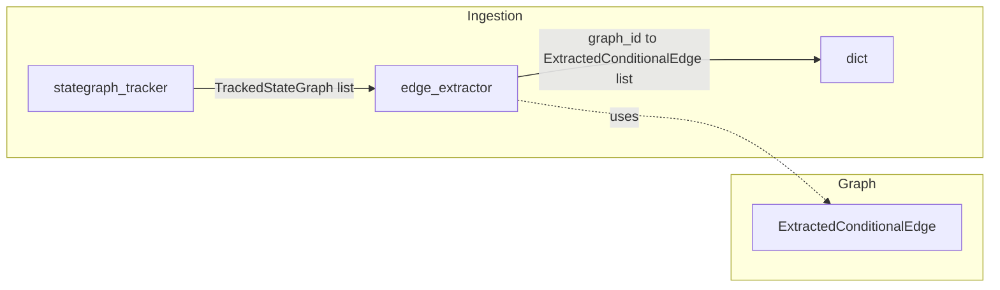

**Data flow:**
- **Input:** Same as sequential edges: `(source, file_path, list[TrackedStateGraph])`.
- **path_map:** Only dict literals are supported; variable path_map is skipped. One `ExtractedConditionalEdge` per (key, value) in path_map: `condition_label` from key, `target` from value (END -> `"END"`).
- **Output:** `dict[graph_id, list[ExtractedConditionalEdge]]` with `ExtractedConditionalEdge(source, condition_label, target, line)`.

---

## 6. Entry point

How the workflow entry node is detected per graph.

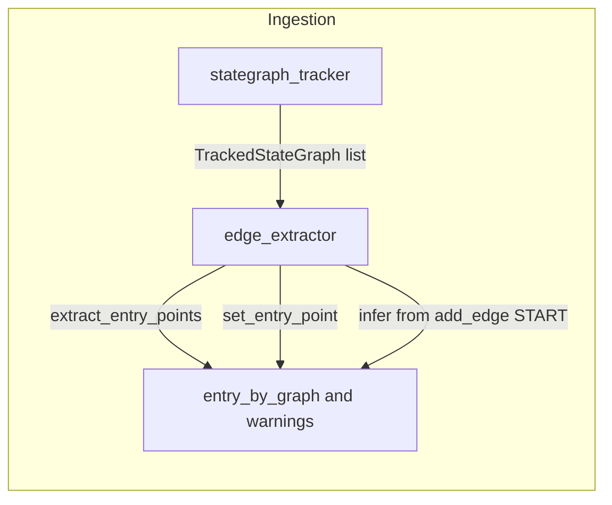

**Data flow:**
- **Explicit:** `set_entry_point(name)` on receiver that resolves to tracked graph -> `entry_by_graph[graph_id] = name`.
- **Fallback:** If no set_entry_point, infer from single `add_edge(START, target)` for that graph; else None.
- **Warnings:** When entry is None (missing or ambiguous), append a message to `warnings` list.
- **Output:** `(dict[graph_id, str | None], list[str])`.

---

## 7. Detection and tracking (file-level)

How we decide a file has LangGraph and how we get graph instances.

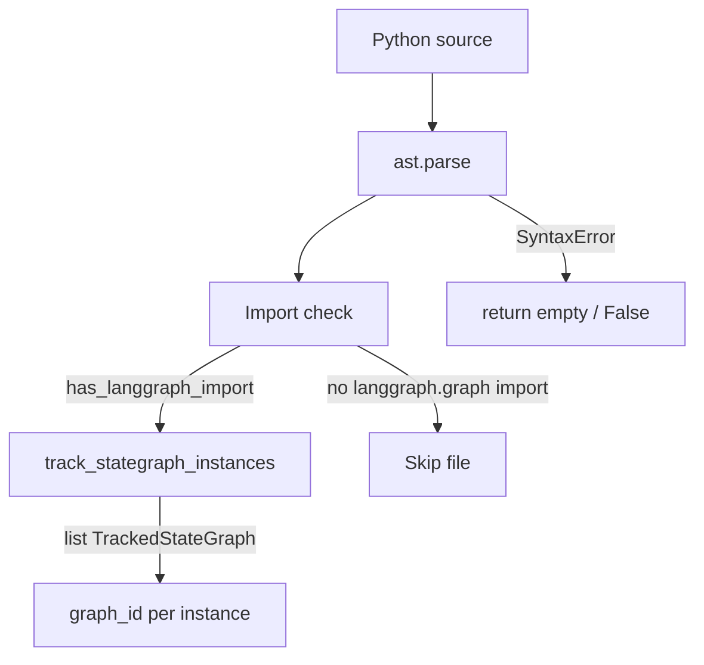

- **Fast path:** `has_langgraph_import(source)` — one AST pass over imports; use to skip files with no `langgraph.graph` import.
- **Full check:** `file_contains_langgraph(source)` uses `track_stategraph_instances`; True iff at least one `StateGraph(...)` is found.

---

## 8. Repo scanning (file discovery)

Before ingestion, the set of Python files to analyze is produced by scanning the repository root with default ignore rules. Only project code is considered; virtual environments, site-packages, and tests are excluded by default.

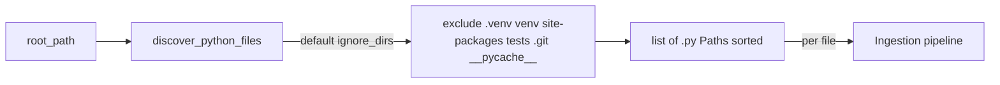

**Default ignore list** (any path containing one of these as a segment is skipped):

| Directory       | Reason |
|----------------|--------|
| `.venv`        | Virtual environment (common layout). |
| `venv`         | Alternate virtual environment name. |
| `site-packages`| Installed packages; Phase-1 is project code only. |
| `tests`        | Test code is out of scope for workflow extraction in Phase-1. |
| `.git`         | Version control metadata. |
| `__pycache__`  | Bytecode cache. |

**API:**
- **`discover_python_files(root_path, ignore_dirs=None)`** — Returns a **sorted** list of `Path` objects for every `.py` file under `root_path` that does not contain any ignored directory name. `root_path` can be `Path` or `str`; `ignore_dirs` is an optional sequence (if `None`, the default list above is used). Deterministic: same repo and same tool version produce the same list order.
- **`DEFAULT_IGNORE_DIRS`** — The default tuple of ignored directory names; exportable for reference or custom logic.

**Data flow:** Input is `root_path` (directory) and optional `ignore_dirs`. Output is the sorted list of paths. Each path is typically read and passed through the ingestion pipeline (detector, tracker, node/edge extraction).

---

## 9. Error handling (pipeline safety)

**Strategy:** Best-effort. Invalid or unsupported code: warn and continue; skip and report; emit partial when possible. No fail-fast (see [phase1-scope.md](phase1-scope.md) §8).

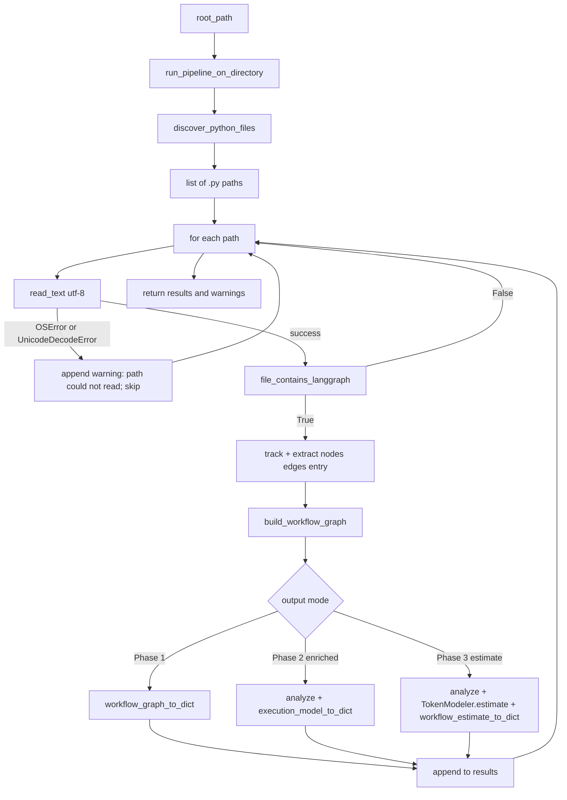

**Where the library does not crash:** All public ingestion APIs that take `source: str` catch `SyntaxError` and return safe empty/false values:
- `has_langgraph_import` / `file_contains_langgraph` → False
- `track_stategraph_instances` → []
- `extract_add_node_calls` → {}
- `extract_add_edge_calls` / `extract_add_conditional_edges` → {}
- `extract_entry_points` → ({}, [])

**Where warnings come from:**
- **`extract_entry_points`** returns `(entry_by_graph, warnings)` with messages:
  - `"graph_id {gid}: no entry point detected"`
  - `"graph_id {gid}: ambiguous entry (multiple add_edge(START, ...))"`
- **`run_pipeline_on_directory`** (when reading files) appends:
  - `"{path}: could not read"` on OSError or UnicodeDecodeError for that file.

**Tool does not crash:** `run_pipeline_on_directory(root_path, enriched=False, estimate=False)` (Phase 1), `run_pipeline_on_directory(root_path, enriched=True, estimate=False)` (Phase 2), and `run_pipeline_on_directory(root_path, estimate=True)` (Phase 3) all run discover → read each file → ingest → build WorkflowGraph → serialize (base, enriched, or estimated). File-read errors are caught and skipped with warnings, so the pipeline does not raise for invalid or unreadable files.

---

## 10. Generate graph of agents (Mermaid)

From an extracted workflow dict you can produce a **Mermaid flowchart** (graph of agents and edges) for visualization or export.

**How to generate the graph:**
1. Get a workflow dict: run the pipeline (e.g. `run_pipeline_on_directory(root)`), then use each result dict; or build a `WorkflowGraph` and call `workflow_graph_to_dict(g)`.
2. Call `workflow_dict_to_mermaid(d)` from `noctyl.graph`. It returns a Mermaid string (flowchart TB) with:
   - **Nodes:** START and END (as distinct nodes), plus each workflow node (agent/step) by name.
   - **Edges:** Sequential edges (`source --> target`) and conditional edges (`source -->|condition_label| target`).
3. Render the string in any Mermaid-capable viewer (e.g. GitHub, Mermaid Live Editor) or write to a `.mmd` file.

**Example (Python):**
```python
from noctyl.graph import workflow_graph_to_dict, workflow_dict_to_mermaid
from noctyl.ingestion import run_pipeline_on_directory

results, _ = run_pipeline_on_directory("path/to/repo")
for d in results:
    mermaid = workflow_dict_to_mermaid(d)
    print(mermaid)  # or open("graph.mmd", "w").write(mermaid)
```

Entry and terminal nodes appear via edges: START → entry_point, and terminal nodes → END. Conditional edge labels are shown on the arrows.

---

## 11. Phase 2: GraphAnalyzer, ExecutionModel and enriched output

Phase 2 adds the **GraphAnalyzer** in `noctyl/analysis`: it takes a **WorkflowGraph** and optional `source` and `file_path`, runs control-flow (SCC, cycles, shape), metrics, node annotation, and structural risk, and returns an **ExecutionModel**. The ExecutionModel holds the Phase 1 graph plus `shape`, `cycles`, `metrics`, `node_annotations`, and `risks`. **execution_model_to_dict(model)** produces a deterministic JSON-serializable dict with `schema_version` 2.0 and `enriched: true`, including the base graph (from `workflow_graph_to_dict(model.graph)`) and enriched fields. No token or cost fields; analysis is static and LangGraph-only.

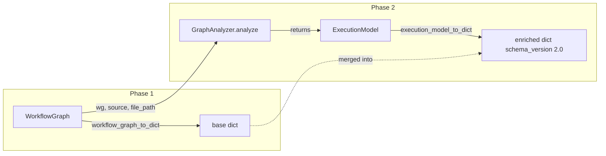

**API:** `analyze(workflow_graph, *, source=None, file_path=None) -> ExecutionModel` (or `GraphAnalyzer().analyze(...)`). When `source` (and optionally `file_path`) is provided, node annotations use the source for origin, state interaction, and role heuristics; otherwise annotations are unknown.

**ExecutionModel fields:** `graph` (WorkflowGraph), `entry_point`, `terminal_nodes`, `shape` (linear | branching | cyclic | disconnected | invalid), `cycles` (DetectedCycle), `metrics` (StructuralMetrics), `node_annotations` (NodeAnnotation), `risks` (StructuralRisk).

### 11a. Internal analysis pipeline

Inside `GraphAnalyzer.analyze`, the WorkflowGraph passes through five analysis stages. Each stage is a separate module in `noctyl/analysis/`.

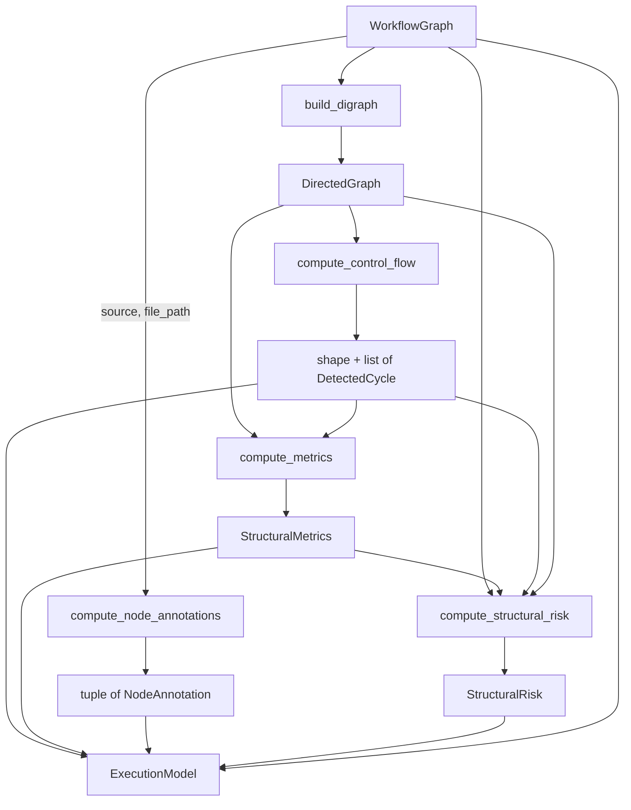

| Module | Responsibility |
|--------|---------------|
| `digraph.py` | Build `DirectedGraph` (adjacency lists + conditional-edge set) from WorkflowGraph; includes START/END sentinel nodes. |
| `control_flow.py` | Tarjan's SCC algorithm for cycle detection; classify each cycle as `self_loop`, `multi_node`, `conditional`, or `non_terminating`; termination reachability (BFS to END); graph shape classification. |
| `metrics.py` | Node/edge counts, unreachable nodes (BFS from START), longest acyclic path (DFS), average branching factor, max depth before first cycle node. |
| `node_annotation.py` | Per-node semantic annotation from AST: `origin` (local_function, imported_function, class_method, lambda, unknown), `state_interaction` (pure, read_only, mutates_state, unknown), `role` (llm_like, tool_like, control_node, unknown). |
| `structural_risk.py` | Aggregate risks: unreachable node IDs, dead-end IDs (out-degree 0, not terminal), non-terminating cycle IDs, multiple entry points flag. |

All algorithms use Python's standard library only (no `networkx` dependency).

---

## 12. Pipeline with three output modes (Phase 1 / Phase 2 / Phase 3)

The pipeline supports three output modes: Phase 1 (base graph structure), Phase 2 (enriched with analysis), and Phase 3 (estimated with token envelopes). Phase-1-only callers receive base dicts (schema 1.0); Phase 2 callers receive enriched dicts (schema 2.0) with cycles, shape, metrics, node_annotations, and risks; Phase 3 callers receive estimated dicts (schema 3.0) with all Phase 2 data plus token estimation fields.

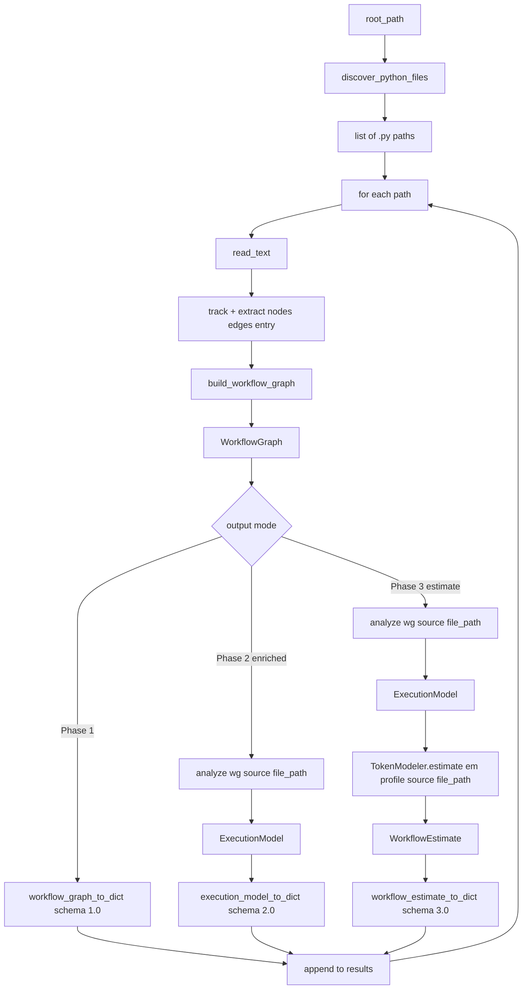

**API:** `run_pipeline_on_directory(root_path, enriched=False, estimate=False, profile=None)`. 

- **Phase 1 (default):** `enriched=False, estimate=False` → schema 1.0 base dicts
- **Phase 2:** `enriched=True, estimate=False` → schema 2.0 enriched dicts
- **Phase 3:** `estimate=True` → schema 3.0 estimated dicts (automatically sets `enriched=True`)

When `estimate=True`, the pipeline uses the Phase 3 path: for each graph it calls `analyze(wg, source=source, file_path=file_path)` → `TokenModeler.estimate(em, profile, source=source, file_path=file_path)` → `workflow_estimate_to_dict(estimate)` and returns schema 3.0 dicts. Backward compatibility: existing callers that omit `enriched` get Phase-1-only output; `enriched=True` alone returns Phase 2 output.

---

## 13. Phase 3: TokenModeler and cost envelope estimation

Phase 3 adds the **TokenModeler** in `noctyl/estimation`: it takes an **ExecutionModel** (from Phase 2), a **ModelProfile**, and optional source code, computes node token signatures, propagates token quantities, handles loop amplification and branch envelopes, and returns a **WorkflowEstimate**. The WorkflowEstimate holds the ExecutionModel reference plus `node_signatures`, `envelope` (workflow-level cost envelope), `per_node_envelopes`, `per_path_envelopes`, and `warnings`. **workflow_estimate_to_dict(estimate)** produces a deterministic JSON-serializable dict with `schema_version` 3.0, `estimated: true`, and `enriched: true` (includes all Phase 2 data plus estimation fields).

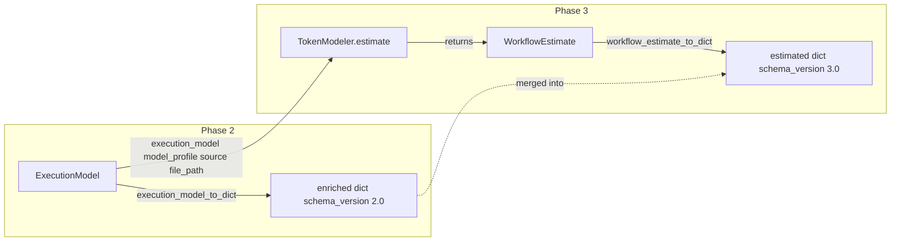

**API:** `TokenModeler.estimate(execution_model, model_profile, *, source=None, file_path=None) -> WorkflowEstimate`. The internal pipeline: prompt detection → token signatures → propagation → loop amplification → branch envelopes → aggregation. When `source` (and optionally `file_path`) is provided, prompt size detection uses AST analysis; otherwise nodes are marked symbolic with conservative defaults.

**WorkflowEstimate fields:** `graph_id`, `execution_model` (ExecutionModel), `node_signatures` (NodeTokenSignature tuple), `envelope` (CostEnvelope), `assumptions_profile` (str), `per_node_envelopes` (dict), `per_path_envelopes` (dict), `warnings` (str tuple).

### 13a. Internal TokenModeler pipeline

Inside `TokenModeler.estimate`, the ExecutionModel passes through estimation stages:

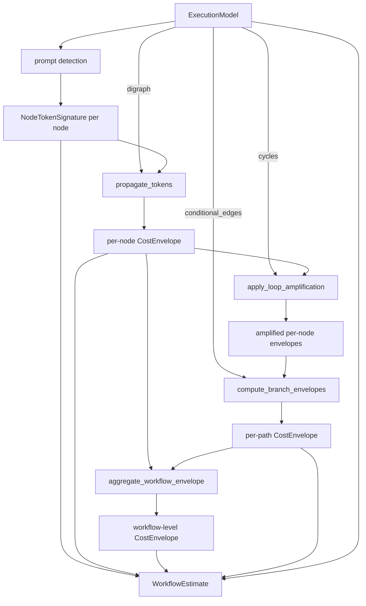

| Stage | Responsibility |
|-------|---------------|
| `prompt_detection.py` | AST-based extraction of string literals/f-strings from node callables; estimate `base_prompt_tokens`; mark symbolic if unresolvable. |
| `propagation.py` | Token propagation: `T_out = (T_in + base_prompt) × expansion_factor`; topological traversal; accumulate min/expected/max per node. |
| `loop_amplification.py` | Apply Phase 2 cycle data: bounded loops → `iterations × cost`; unbounded → configurable default iterations (default 5); widen envelopes. |
| `branch_envelope.py` | At conditional branches: compute min (cheapest path), max (most expensive), expected (midpoint); nest with loops. |
| `aggregation.py` | Sum propagated costs from entry to terminals; aggregate workflow-level envelope; report `bounded` flag. |
| `token_modeler.py` | Main TokenModeler class orchestrating the full pipeline: prompt detection → propagation → loop amplification → branch envelopes → aggregation. |

### 13b. Token propagation detailed flow (Task 3)

Token propagation applies the formula `T_out = (T_in + base_prompt) × expansion_factor` through the workflow graph using topological traversal.

```mermaid
flowchart TB
    Digraph[DirectedGraph] --> TopoSort[topological_sort]
    NodeSigs[NodeTokenSignature tuple] --> SigMap[build sig_map]
    TopoSort --> ForEach[for each node in topological order]
    
    ForEach --> CheckPred{has predecessors?}
    CheckPred -->|no START only| EntryPoint[start with base_prompt_tokens]
    CheckPred -->|has predecessors| Accumulate[accumulate from all predecessors]
    
    Accumulate --> ApplyFormula[apply T_out = (T_in + base_prompt) × expansion_factor]
    ApplyFormula --> SumPaths[sum across all incoming paths]
    
    EntryPoint --> CheckCycle{in cycle?}
    SumPaths --> CheckCycle
    
    CheckCycle -->|yes| BoundedFalse[bounded=False]
    CheckCycle -->|no| BoundedTrue[bounded=True]
    
    BoundedFalse --> Envelope[CostEnvelope]
    BoundedTrue --> Envelope
    
    Envelope --> PerNode[per_node dict]
```

**Key points:**
- Entry points (nodes with START as predecessor) start with `base_prompt_tokens` (no expansion_factor applied yet)
- Multiple incoming edges: sum envelopes from all predecessors
- Expansion factor from `node_signature.expansion_factor` takes precedence over `model_profile.expansion_factor`
- Nodes in cycles marked `bounded=False` initially (loop amplification handles bounds)

### 13c. Loop amplification detailed flow (Task 3)

Loop amplification multiplies cycle node envelopes by iteration count.

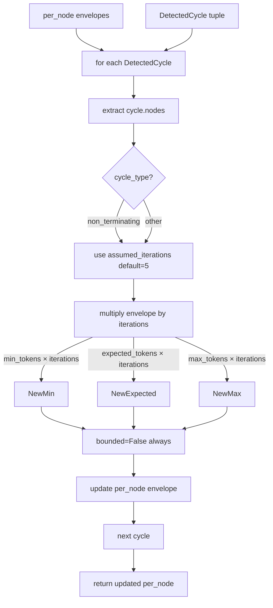

**Key points:**
- All cycles treated as unbounded (Phase 2 doesn't detect iteration bounds yet)
- Default `assumed_iterations = 5` (configurable parameter)
- Non-terminating cycles use same assumed_iterations but generate warnings separately
- Each cycle node's envelope multiplied independently

### 13d. Branch envelope detailed flow (Task 3)

Branch envelope computation aggregates costs across conditional paths.

```mermaid
flowchart TB
    Digraph[DirectedGraph] --> GroupBySource[group conditional_edges by source]
    CondEdges[ExtractedConditionalEdge tuple] --> GroupBySource
    
    GroupBySource --> ForEachBranch[for each branch point]
    PerNode[per_node envelopes] --> ForEachBranch
    
    ForEachBranch --> ForEachPath[for each conditional path]
    ForEachPath --> FindPaths[find_paths_to_terminals from target]
    
    FindPaths --> TraversePath[traverse path summing envelopes]
    TraversePath --> PathEnv[path CostEnvelope]
    
    PathEnv --> CollectPaths[collect all path envelopes]
    CollectPaths --> Aggregate[aggregate min/expected/max]
    
    Aggregate -->|min = min across paths| MinCost
    Aggregate -->|max = max across paths| MaxCost
    Aggregate -->|expected = (min + max) / 2| ExpectedCost
    ExpectedCost --> Clamp[clamp expected between min and max]
    
    MinCost --> CreateEnv[CostEnvelope]
    MaxCost --> CreateEnv
    Clamp --> CreateEnv
    
    CreateEnv --> PathKey[path_key = source:condition_label]
    PathKey --> PerPath[per_path dict]
```

**Key points:**
- Path traversal: BFS from branch target to terminal nodes, summing envelopes
- Branch envelope: min = cheapest path, max = most expensive path, expected = (min + max) / 2 (midpoint)
- Expected value is clamped to be between min and max (invariant enforcement)
- Path keys: `"{source_node}:{condition_label}"` for determinism
- Bounded flag: True only if all paths have bounded=True

### 13e. Aggregation detailed flow (Task 3)

Workflow aggregation sums costs from entry point to all terminal nodes.

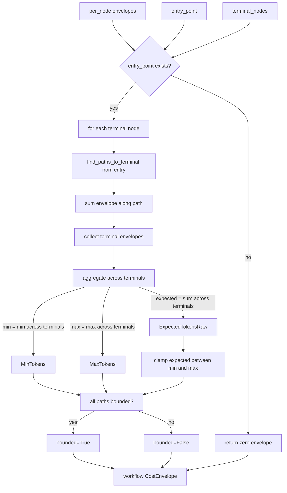

**Key points:**
- Path finding: BFS/DFS from entry_point to each terminal
- Multiple paths to same terminal: use maximum envelope (worst case)
- Aggregation: min = min across terminals, max = max across terminals, expected = sum of expected across terminals
- Invariant: expected_tokens is clamped to be between min_tokens and max_tokens (enforced after summing)

### 13f. Prompt detection detailed flow (Task 2)

The prompt detection stage (`compute_node_token_signatures`) extracts string literals from node callables using AST analysis. This is the foundation for token estimation.

```mermaid
flowchart TB
  WG[WorkflowGraph] --> CompSig[compute_node_token_signatures]
  Source[source: str | None] --> CompSig
  Profile[ModelProfile] --> CompSig
  
  CompSig -->|source is None| SymbolicAll[all nodes symbolic default]
  CompSig -->|source provided| Parse[ast.parse source]
  
  Parse -->|SyntaxError| SymbolicAll
  Parse -->|success| ForEach[for each node in WG.nodes]
  
  ForEach --> Resolve[resolve callable_ref]
  Resolve -->|local function| Detect[detect_prompt_strings]
  Resolve -->|imported/lambda/class_method| SymbolicNode[symbolic NodeTokenSignature]
  
  Detect --> ASTWalk[_extract_strings_from_node]
  ASTWalk --> Fragments[list PromptFragment]
  
  Fragments --> Check{any fragment symbolic?}
  Check -->|yes| SymbolicNode
  Check -->|no| SumTokens[sum token_estimate from fragments]
  
  SumTokens --> CheckInput[_has_input_dependency]
  CheckInput -->|has params/state refs| InputDep[input_dependency=True]
  CheckInput -->|no params| NoInputDep[input_dependency=False]
  
  InputDep --> NodeSig[NodeTokenSignature]
  NoInputDep --> NodeSig
  SymbolicNode --> NodeSig
  
  NodeSig --> Sort[sort by node_name]
  Sort --> Output[tuple NodeTokenSignature]
```

**String extraction (`_extract_strings_from_node`):**

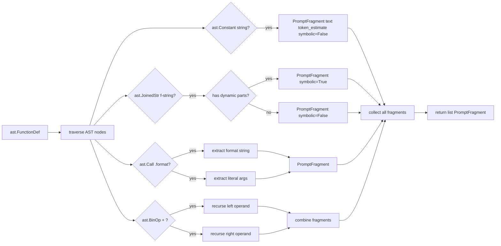

**Callable resolution (reuses Phase 2 patterns):**

- **Local function:** `callable_ref == "func_name"` → find `ast.FunctionDef` with `name == "func_name"` in same AST
- **Imported function:** `callable_ref == "module.func"` → mark symbolic (can't resolve body)
- **Class method:** `callable_ref == "self.method"` → mark symbolic (can't resolve body)
- **Lambda:** `callable_ref == "lambda"` → mark symbolic (hard to analyze)

**Token estimation (`estimate_tokens_from_string`):**
- Heuristic: `max(1, len(text) // 4)` (simple character-to-token approximation)
- Minimum 1 token for any non-empty string

**Input dependency detection (`_has_input_dependency`):**
- Returns `True` if function has any parameters (conservative heuristic)
- Also checks for `state` or `input` references in function body
- Used to mark nodes that depend on runtime input

**Output:** Sorted tuple of `NodeTokenSignature` (by `node_name`) with:
- `base_prompt_tokens`: sum of token estimates from detected fragments (0 if symbolic)
- `expansion_factor`: from `ModelProfile`
- `input_dependency`: boolean from heuristic
- `symbolic`: True if unresolvable, syntax error, or dynamic content detected

---

## 14. Pipeline with Phase 3 estimation output

When the pipeline is run with Phase 3 integration (`estimate=True`), after building the WorkflowGraph and analyzing via GraphAnalyzer (Phase 2), the runner calls TokenModeler (Phase 3) and serializes the WorkflowEstimate for schema 3.0 output. The pipeline now supports three output modes: Phase 1 (base), Phase 2 (enriched), and Phase 3 (estimated). Phase 3 output includes all Phase 2 data plus token estimation fields.

```mermaid
flowchart TB
  Root[root_path] --> Discover[discover_python_files]
  Discover --> Paths[list of .py paths]
  Paths --> Loop[for each path]
  Loop --> Read[read_text]
  Read --> Ingest[track + extract nodes edges entry]
  Ingest --> Build[build_workflow_graph]
  Build --> WG[WorkflowGraph]
  WG --> Choice{output mode}
  Choice -->|Phase 1| Base[workflow_graph_to_dict]
  Choice -->|Phase 2 enriched| Analyze[analyze wg source file_path]
  Analyze --> EM[ExecutionModel]
  EM --> Enriched[execution_model_to_dict]
  Choice -->|Phase 3 estimate| Analyze2[analyze wg source file_path]
  Analyze2 --> EM2[ExecutionModel]
  EM2 --> Estimate[TokenModeler.estimate em profile source file_path]
  Estimate --> WE[WorkflowEstimate]
  WE --> Estimated[workflow_estimate_to_dict]
  Base --> Append[append to results]
  Enriched --> Append
  Estimated --> Append
  Append --> Loop
```

**API:** `run_pipeline_on_directory(root_path, enriched=False, estimate=False, profile=None)`. When `estimate=True`, the pipeline uses the Phase 3 path: for each graph it calls `analyze(wg, source=source, file_path=file_path)` → `TokenModeler.estimate(em, profile, source=source, file_path=file_path)` → `workflow_estimate_to_dict(estimate)` and returns schema 3.0 dicts. `estimate=True` implies `enriched=True` (Phase 2 data included). Backward compatibility: `enriched=True` alone returns schema 2.0; `estimate=False` (default) returns Phase 1 base dicts.

**Output schemas:**
- **Phase 1:** `schema_version: "1.0"` — base graph structure only
- **Phase 2:** `schema_version: "2.0"`, `enriched: true` — adds shape, cycles, metrics, node_annotations, risks
- **Phase 3:** `schema_version: "3.0"`, `estimated: true`, `enriched: true` — adds token_estimate, node_signatures, per_node_envelopes, per_path_envelopes, warnings

---

## 14a. CLI Estimate Command Flow

The `noctyl estimate` CLI command provides a command-line interface for token estimation. It parses arguments, passes the profile path (if provided) to the pipeline, invokes the pipeline with `estimate=True`, and outputs JSON to stdout or a file. Profile loading is handled internally by the pipeline.

```mermaid
flowchart TB
  CLI[noctyl estimate command] --> Parse[argparse: parse args]
  Parse --> PathArg[path argument]
  Parse --> ProfileFlag[--profile flag optional]
  Parse --> OutputFlag[--output flag optional]
  
  PathArg --> ValidatePath[validate path exists]
  ValidatePath -->|invalid| Error[print error to stderr, exit 1]
  ValidatePath -->|valid| Pipeline[run_pipeline_on_directory path estimate=True profile]
  
  ProfileFlag --> Pipeline
  Pipeline --> Results[results list of dicts]
  Pipeline --> Warnings[warnings list]
  
  Results --> Serialize[json.dumps results indent=2 sort_keys=True]
  Serialize --> Output{--output flag?}
  
  Output -->|yes| WriteFile[write JSON to file]
  Output -->|no| PrintStdout[print JSON to stdout]
  
  WriteFile --> CheckWarnings{warnings present?}
  PrintStdout --> CheckWarnings
  
  CheckWarnings -->|yes| PrintStderr[print warnings to stderr]
  CheckWarnings -->|no| Exit0[exit code 0]
  PrintStderr --> Exit1[exit code 1]
```

**CLI Usage:**
```bash
# Basic usage (default profile)
noctyl estimate ./my_project

# With custom profile
noctyl estimate ./my_project --profile profiles/gpt-4o.yaml

# Save to file
noctyl estimate ./my_project --output estimates.json

# With profile and output file
noctyl estimate ./my_project --profile profiles/gpt-4o.yaml --output estimates.json
```

**Profile File Format (YAML):**
```yaml
# Single profile format
name: gpt-4o
expansion_factor: 1.2
output_ratio: 0.6
pricing:
  input_per_1k: 0.005
  output_per_1k: 0.015

# Multi-profile format
model_profiles:
  gpt-4o:
    expansion_factor: 1.2
    output_ratio: 0.6
    pricing:
      input_per_1k: 0.005
      output_per_1k: 0.015
  claude-3:
    expansion_factor: 1.1
    output_ratio: 0.5
    pricing:
      input_per_1k: 0.003
      output_per_1k: 0.015
```

**Error Handling:**
- Invalid path: prints error to stderr, exits with code 1
- Profile loading: handled by pipeline (`run_pipeline_on_directory`), which calls `load_model_profile` internally. On error, pipeline falls back to default profile and adds warning.
- File read errors: handled by pipeline, warnings collected
- JSON serialization errors: prints error to stderr, exits with code 1

---

*Add new flow diagrams to this document as the pipeline grows (entry/exit, compile, etc.).*
