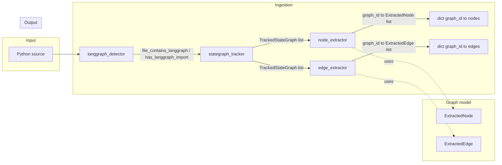
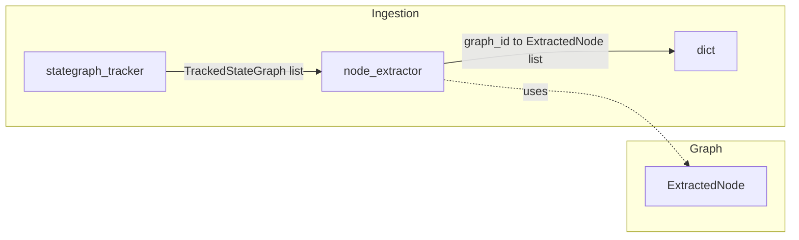
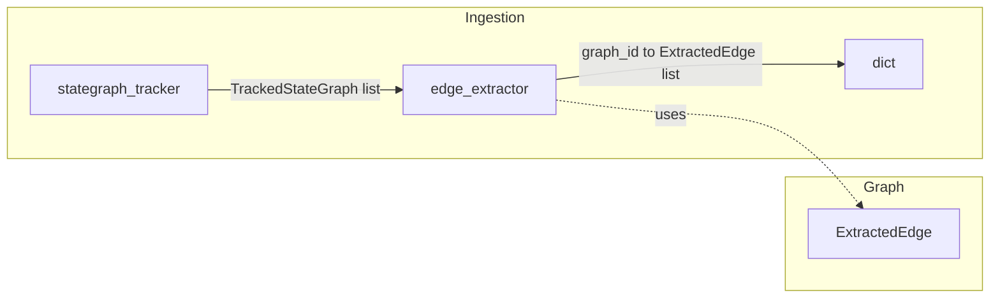
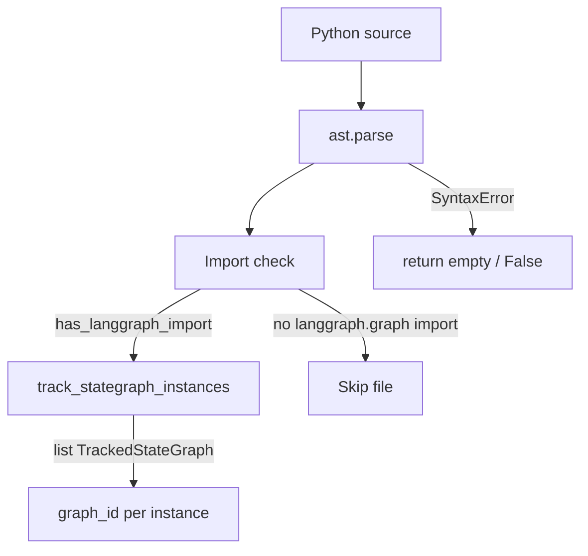

# Noctyl flow diagrams

This document collects flow and architecture diagrams for the Noctyl pipeline. All diagrams use Mermaid and can be rendered on GitHub or in any Mermaid-capable viewer.

**Maintenance:** Keep this document in sync with the codebase. When adding or changing pipeline steps (e.g. edge extraction, entry point, compile, repo scanner), add or update the corresponding diagram and section here.

---

## 1. LangGraph ingestion pipeline (Phase-1)

End-to-end flow from Python source to extracted graph structure.

**Steps:**
1. **langgraph_detector** — File-level check: does this file contain LangGraph? (`file_contains_langgraph`, `has_langgraph_import`).
2. **stategraph_tracker** — Find every `StateGraph(...)` and track variable name and `graph_id` per instance.
3. **node_extractor** — For each tracked graph, find `add_node(name, callable)` calls whose receiver resolves to that graph; emit `ExtractedNode(name, callable_ref, line)` per graph. Uses shared **receiver_resolution** (alias map + resolve_receiver).
4. **edge_extractor** — For each tracked graph, find `add_edge(source, target)` calls; emit `ExtractedEdge(source, target, line)` per graph. Same receiver resolution; source/target stringified (literal, START/END, or best-effort).

---

## 2. Node extraction flow

How add_node calls are attributed to tracked StateGraph instances.

**Data flow:**
- **Input:** `(source, file_path, list[TrackedStateGraph])`.
- **Same-file alias resolution:** Build `name -> root` so that `h = g` and `g` = StateGraph variable implies `h.add_node(...)` is attributed to `g`’s `graph_id`.
- **Output:** `dict[graph_id, list[ExtractedNode]]` with `ExtractedNode(name, callable_ref, line)`.

---

## 3. Edge extraction flow

How add_edge calls are attributed to tracked StateGraph instances.

**Data flow:**
- **Input:** `(source, file_path, list[TrackedStateGraph])`.
- **Same-file alias resolution:** Same as node extraction (shared `receiver_resolution.build_alias_map`, `resolve_receiver`).
- **Source/target:** Literal string -> value; Name (e.g. START, END) -> id; other -> unparse/repr. Missing nodes do not prevent extraction.
- **Output:** `dict[graph_id, list[ExtractedEdge]]` with `ExtractedEdge(source, target, line)`.

---

## 4. Detection and tracking (file-level)

How we decide a file has LangGraph and how we get graph instances.

- **Fast path:** `has_langgraph_import(source)` — one AST pass over imports; use to skip files with no `langgraph.graph` import.
- **Full check:** `file_contains_langgraph(source)` uses `track_stategraph_instances`; True iff at least one `StateGraph(...)` is found.

---

*Add new flow diagrams to this document as the pipeline grows (entry/exit, compile, conditional edges, repo scanner, etc.).*
