# Noctyl flow diagrams

This document collects flow and architecture diagrams for the Noctyl pipeline. All diagrams use Mermaid and can be rendered on GitHub or in any Mermaid-capable viewer.

**Maintenance:** Keep this document in sync with the codebase. When adding or changing pipeline steps (e.g. edge extraction, entry point, compile, repo scanner, Phase 2 GraphAnalyzer), add or update the corresponding diagram and section here.

---

## 1. LangGraph ingestion pipeline (Phase-1)

End-to-end flow from Python source to extracted graph structure.

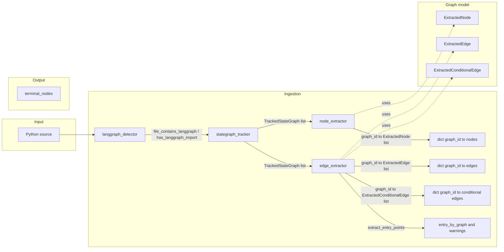

**Steps:**
0. **Repo scanning** — `discover_python_files(root_path)` yields the list of `.py` paths to analyze; default ignores `.venv`, `venv`, `site-packages`, `tests`, `.git`, `__pycache__` (see [§8](#8-repo-scanning-file-discovery)).
1. **langgraph_detector** — File-level check: does this file contain LangGraph? (`file_contains_langgraph`, `has_langgraph_import`).
2. **stategraph_tracker** — Find every `StateGraph(...)` and track variable name and `graph_id` per instance.
3. **node_extractor** — For each tracked graph, find `add_node(name, callable)` calls whose receiver resolves to that graph; emit `ExtractedNode(name, callable_ref, line)` per graph. Uses shared **receiver_resolution** (alias map + resolve_receiver).
4. **edge_extractor** — For each tracked graph: (a) `add_edge(source, target)` -> `ExtractedEdge(source, target, line)`; (b) `add_conditional_edges(source, path, path_map)` with dict-literal path_map -> one `ExtractedConditionalEdge(source, condition_label, target, line)` per path_map entry. END as target supported. (c) **Entry point:** `extract_entry_points` returns `(entry_by_graph, warnings)` from `set_entry_point(name)` or fallback from single `add_edge(START, target)`; warning when missing. Same receiver resolution.
5. **Graph schema:** Ingestion outputs (nodes, edges, conditional_edges, entry_point per graph_id) are assembled into a **WorkflowGraph** via `build_workflow_graph`; **workflow_graph_to_dict** produces a deterministic JSON-serializable dict; JSON Schema in `noctyl/graph/schema.json` describes the serialized shape. **END and terminal nodes:** END is represented as target `"END"` in edges and conditional_edges; `terminal_nodes` is a first-class list of node names that have an outgoing edge or conditional edge to END (distinguishable without scanning edges).

---

## 2. Graph schema and serialization

Ingestion outputs per graph_id are aggregated into WorkflowGraph and serialized to JSON.

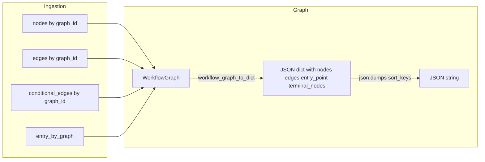

**Data flow:**
- **build_workflow_graph(graph_id, nodes, edges, conditional_edges, entry_point)** builds a WorkflowGraph (schema_version, graph_id, nodes, edges, conditional_edges, entry_point, terminal_nodes). `terminal_nodes` is derived from edges and conditional_edges (sources where target is `"END"`).
- **workflow_graph_to_dict(g)** returns a dict with deterministic list ordering (nodes by name/line, edges by source/target/line, conditional_edges by source/condition_label/target/line). The serialized dict includes **terminal_nodes** (sorted list of node names that transition to END).
- **JSON Schema:** `noctyl/graph/schema.json` defines the serialized document shape (nodes, directed edges, entry_point, terminal_nodes).

---

## 3. Node extraction flow

How add_node calls are attributed to tracked StateGraph instances.

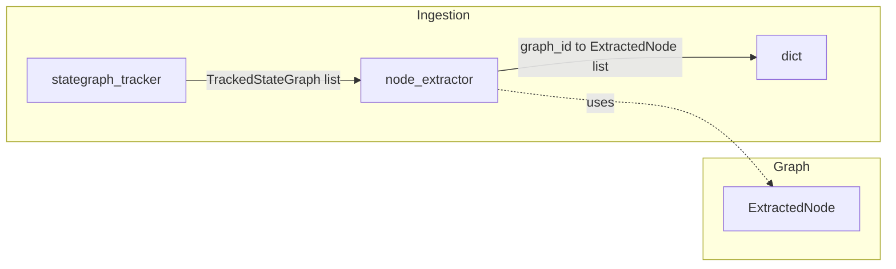

**Data flow:**
- **Input:** `(source, file_path, list[TrackedStateGraph])`.
- **Same-file alias resolution:** Build `name -> root` so that `h = g` and `g` = StateGraph variable implies `h.add_node(...)` is attributed to `g`’s `graph_id`.
- **Output:** `dict[graph_id, list[ExtractedNode]]` with `ExtractedNode(name, callable_ref, line)`.

---

## 4. Edge extraction flow

How add_edge calls are attributed to tracked StateGraph instances.

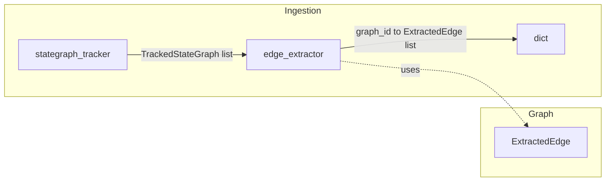

**Data flow:**
- **Input:** `(source, file_path, list[TrackedStateGraph])`.
- **Same-file alias resolution:** Same as node extraction (shared `receiver_resolution.build_alias_map`, `resolve_receiver`).
- **Source/target:** Literal string -> value; Name (e.g. START, END) -> id; other -> unparse/repr. Missing nodes do not prevent extraction.
- **Output:** `dict[graph_id, list[ExtractedEdge]]` with `ExtractedEdge(source, target, line)`.

---

## 5. Conditional edges flow

How add_conditional_edges(path_map) is attributed to tracked StateGraph instances.

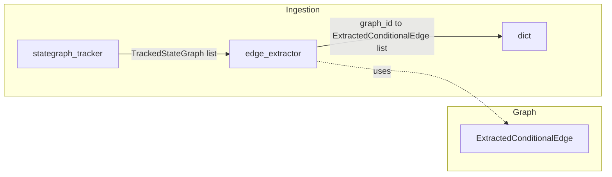

**Data flow:**
- **Input:** Same as sequential edges: `(source, file_path, list[TrackedStateGraph])`.
- **path_map:** Only dict literals are supported; variable path_map is skipped. One `ExtractedConditionalEdge` per (key, value) in path_map: `condition_label` from key, `target` from value (END -> `"END"`).
- **Output:** `dict[graph_id, list[ExtractedConditionalEdge]]` with `ExtractedConditionalEdge(source, condition_label, target, line)`.

---

## 6. Entry point

How the workflow entry node is detected per graph.

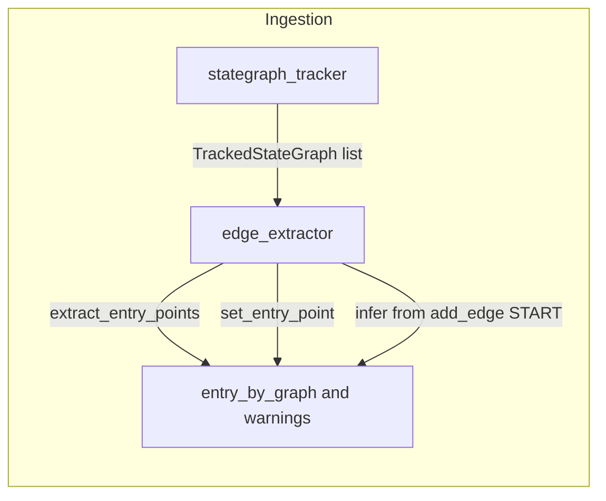

**Data flow:**
- **Explicit:** `set_entry_point(name)` on receiver that resolves to tracked graph -> `entry_by_graph[graph_id] = name`.
- **Fallback:** If no set_entry_point, infer from single `add_edge(START, target)` for that graph; else None.
- **Warnings:** When entry is None (missing or ambiguous), append a message to `warnings` list.
- **Output:** `(dict[graph_id, str | None], list[str])`.

---

## 7. Detection and tracking (file-level)

How we decide a file has LangGraph and how we get graph instances.

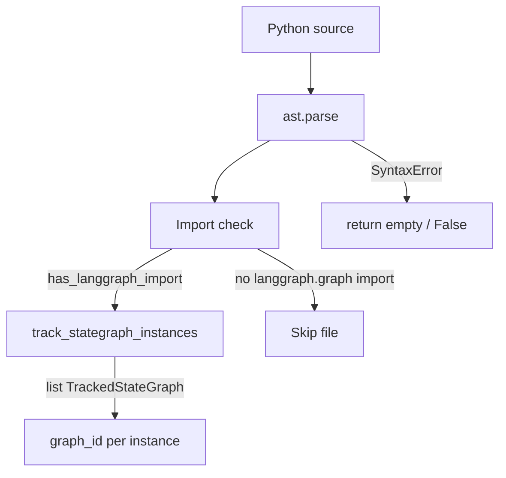

- **Fast path:** `has_langgraph_import(source)` — one AST pass over imports; use to skip files with no `langgraph.graph` import.
- **Full check:** `file_contains_langgraph(source)` uses `track_stategraph_instances`; True iff at least one `StateGraph(...)` is found.

---

## 8. Repo scanning (file discovery)

Before ingestion, the set of Python files to analyze is produced by scanning the repository root with default ignore rules. Only project code is considered; virtual environments, site-packages, and tests are excluded by default.

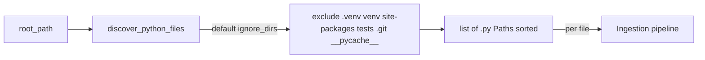

**Default ignore list** (any path containing one of these as a segment is skipped):

| Directory       | Reason |
|----------------|--------|
| `.venv`        | Virtual environment (common layout). |
| `venv`         | Alternate virtual environment name. |
| `site-packages`| Installed packages; Phase-1 is project code only. |
| `tests`        | Test code is out of scope for workflow extraction in Phase-1. |
| `.git`         | Version control metadata. |
| `__pycache__`  | Bytecode cache. |

**API:**
- **`discover_python_files(root_path, ignore_dirs=None)`** — Returns a **sorted** list of `Path` objects for every `.py` file under `root_path` that does not contain any ignored directory name. `root_path` can be `Path` or `str`; `ignore_dirs` is an optional sequence (if `None`, the default list above is used). Deterministic: same repo and same tool version produce the same list order.
- **`DEFAULT_IGNORE_DIRS`** — The default tuple of ignored directory names; exportable for reference or custom logic.

**Data flow:** Input is `root_path` (directory) and optional `ignore_dirs`. Output is the sorted list of paths. Each path is typically read and passed through the ingestion pipeline (detector, tracker, node/edge extraction).

---

## 9. Error handling (pipeline safety)

**Strategy:** Best-effort. Invalid or unsupported code: warn and continue; skip and report; emit partial when possible. No fail-fast (see [phase1-scope.md](phase1-scope.md) §8).

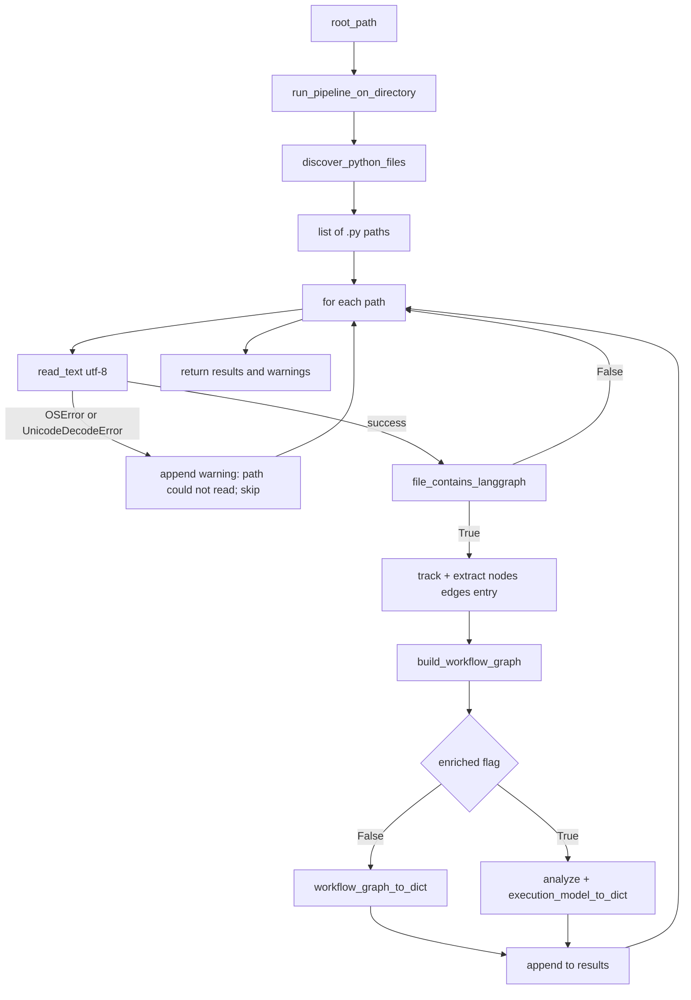

**Where the library does not crash:** All public ingestion APIs that take `source: str` catch `SyntaxError` and return safe empty/false values:
- `has_langgraph_import` / `file_contains_langgraph` → False
- `track_stategraph_instances` → []
- `extract_add_node_calls` → {}
- `extract_add_edge_calls` / `extract_add_conditional_edges` → {}
- `extract_entry_points` → ({}, [])

**Where warnings come from:**
- **`extract_entry_points`** returns `(entry_by_graph, warnings)` with messages:
  - `"graph_id {gid}: no entry point detected"`
  - `"graph_id {gid}: ambiguous entry (multiple add_edge(START, ...))"`
- **`run_pipeline_on_directory`** (when reading files) appends:
  - `"{path}: could not read"` on OSError or UnicodeDecodeError for that file.

**Tool does not crash:** `run_pipeline_on_directory(root_path, enriched=False)` and `run_pipeline_on_directory(root_path, enriched=True)` both run discover → read each file → ingest → build WorkflowGraph → serialize (base or enriched). File-read errors are caught and skipped with warnings, so the pipeline does not raise for invalid or unreadable files.

---

## 10. Generate graph of agents (Mermaid)

From an extracted workflow dict you can produce a **Mermaid flowchart** (graph of agents and edges) for visualization or export.

**How to generate the graph:**
1. Get a workflow dict: run the pipeline (e.g. `run_pipeline_on_directory(root)`), then use each result dict; or build a `WorkflowGraph` and call `workflow_graph_to_dict(g)`.
2. Call `workflow_dict_to_mermaid(d)` from `noctyl.graph`. It returns a Mermaid string (flowchart TB) with:
   - **Nodes:** START and END (as distinct nodes), plus each workflow node (agent/step) by name.
   - **Edges:** Sequential edges (`source --> target`) and conditional edges (`source -->|condition_label| target`).
3. Render the string in any Mermaid-capable viewer (e.g. GitHub, Mermaid Live Editor) or write to a `.mmd` file.

**Example (Python):**
```python
from noctyl.graph import workflow_graph_to_dict, workflow_dict_to_mermaid
from noctyl.ingestion import run_pipeline_on_directory

results, _ = run_pipeline_on_directory("path/to/repo")
for d in results:
    mermaid = workflow_dict_to_mermaid(d)
    print(mermaid)  # or open("graph.mmd", "w").write(mermaid)
```

Entry and terminal nodes appear via edges: START → entry_point, and terminal nodes → END. Conditional edge labels are shown on the arrows.

---

## 11. Phase 2: GraphAnalyzer, ExecutionModel and enriched output

Phase 2 adds the **GraphAnalyzer** in `noctyl/analysis`: it takes a **WorkflowGraph** and optional `source` and `file_path`, runs control-flow (SCC, cycles, shape), metrics, node annotation, and structural risk, and returns an **ExecutionModel**. The ExecutionModel holds the Phase 1 graph plus `shape`, `cycles`, `metrics`, `node_annotations`, and `risks`. **execution_model_to_dict(model)** produces a deterministic JSON-serializable dict with `schema_version` 2.0 and `enriched: true`, including the base graph (from `workflow_graph_to_dict(model.graph)`) and enriched fields. No token or cost fields; analysis is static and LangGraph-only.

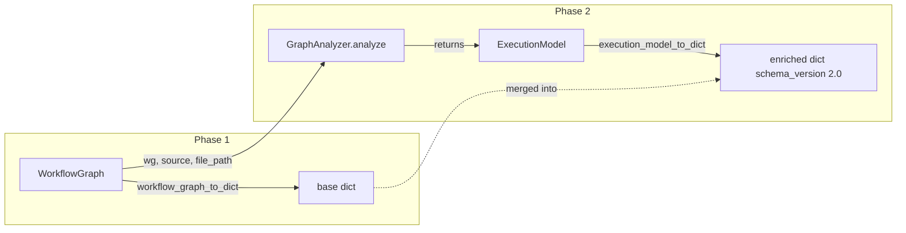

**API:** `analyze(workflow_graph, *, source=None, file_path=None) -> ExecutionModel` (or `GraphAnalyzer().analyze(...)`). When `source` (and optionally `file_path`) is provided, node annotations use the source for origin, state interaction, and role heuristics; otherwise annotations are unknown.

**ExecutionModel fields:** `graph` (WorkflowGraph), `entry_point`, `terminal_nodes`, `shape` (linear | branching | cyclic | disconnected | invalid), `cycles` (DetectedCycle), `metrics` (StructuralMetrics), `node_annotations` (NodeAnnotation), `risks` (StructuralRisk).

### 11a. Internal analysis pipeline

Inside `GraphAnalyzer.analyze`, the WorkflowGraph passes through five analysis stages. Each stage is a separate module in `noctyl/analysis/`.

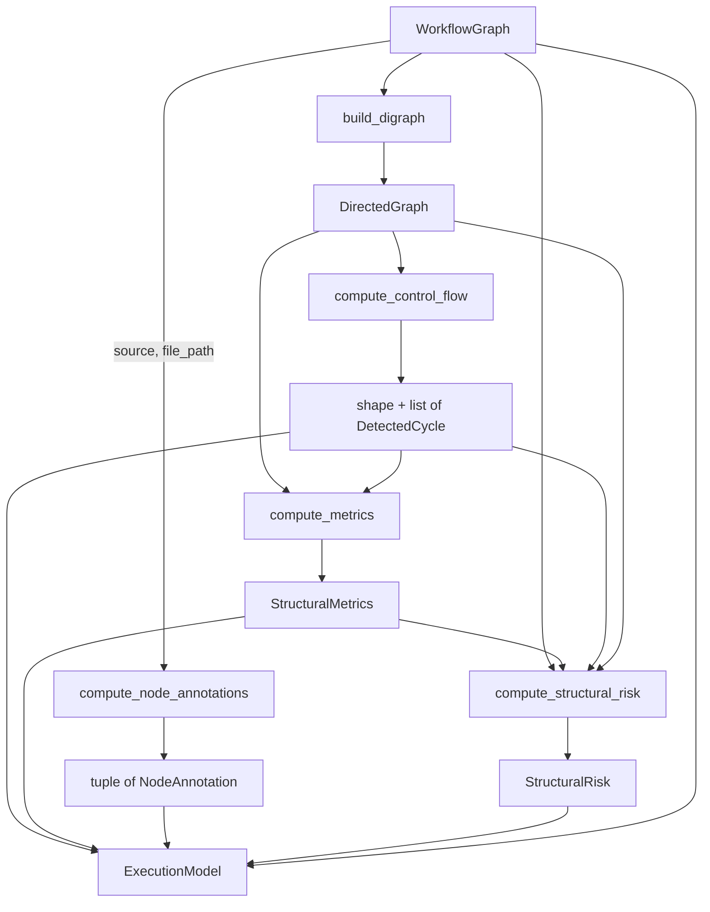

| Module | Responsibility |
|--------|---------------|
| `digraph.py` | Build `DirectedGraph` (adjacency lists + conditional-edge set) from WorkflowGraph; includes START/END sentinel nodes. |
| `control_flow.py` | Tarjan's SCC algorithm for cycle detection; classify each cycle as `self_loop`, `multi_node`, `conditional`, or `non_terminating`; termination reachability (BFS to END); graph shape classification. |
| `metrics.py` | Node/edge counts, unreachable nodes (BFS from START), longest acyclic path (DFS), average branching factor, max depth before first cycle node. |
| `node_annotation.py` | Per-node semantic annotation from AST: `origin` (local_function, imported_function, class_method, lambda, unknown), `state_interaction` (pure, read_only, mutates_state, unknown), `role` (llm_like, tool_like, control_node, unknown). |
| `structural_risk.py` | Aggregate risks: unreachable node IDs, dead-end IDs (out-degree 0, not terminal), non-terminating cycle IDs, multiple entry points flag. |

All algorithms use Python's standard library only (no `networkx` dependency).

---

## 12. Pipeline with optional Phase 2 enriched output

When the pipeline is run with Phase 2 integration, after building each WorkflowGraph the runner can call the analyzer and serialize the ExecutionModel for enriched output. Phase-1-only callers continue to receive base dicts (e.g. from `workflow_graph_to_dict`); enriched callers receive schema 2.0 dicts with cycles, shape, metrics, node_annotations, and risks.

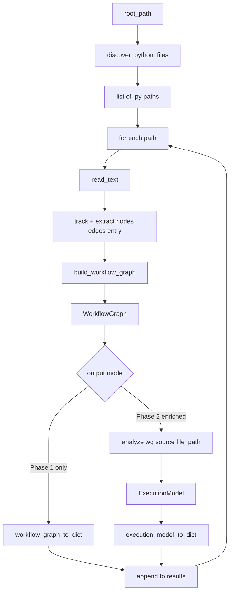

**API:** `run_pipeline_on_directory(root_path, enriched=False)` (default). When `enriched` is False, each result dict is from `workflow_graph_to_dict` (Phase-1). When `enriched` is True, the pipeline uses the Phase 2 path: for each graph it calls `analyze(wg, source=source, file_path=file_path)` then `execution_model_to_dict(model)` and returns those enriched dicts. Backward compatibility: existing callers that omit `enriched` get Phase-1-only output. See [phase2_task3_pipeline_integration.md](../.github/ISSUE_TEMPLATE/phase2_task3_pipeline_integration.md).

---

*Add new flow diagrams to this document as the pipeline grows (entry/exit, compile, etc.).*
